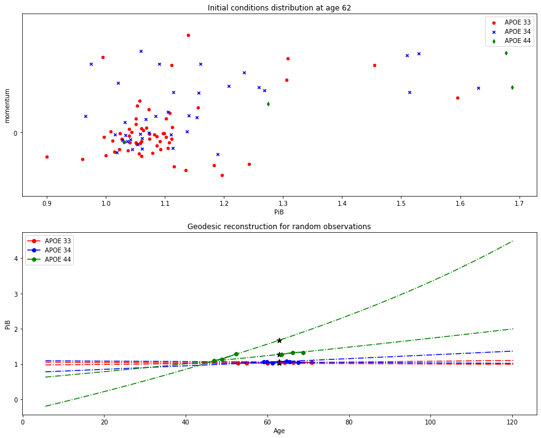

# Analysis of PiB data with differential equations

An analysis of PiB data (from WRAP and BLAS datasets) with differential equations tools.

WRAP data :

### I - For first order ODE

Calibration of trajectories :

Wilcoxon paired test :

### I - For second order ODE

Inverse metric and geodesic reconstruction :

Phase space observation of regressed trajectories :

